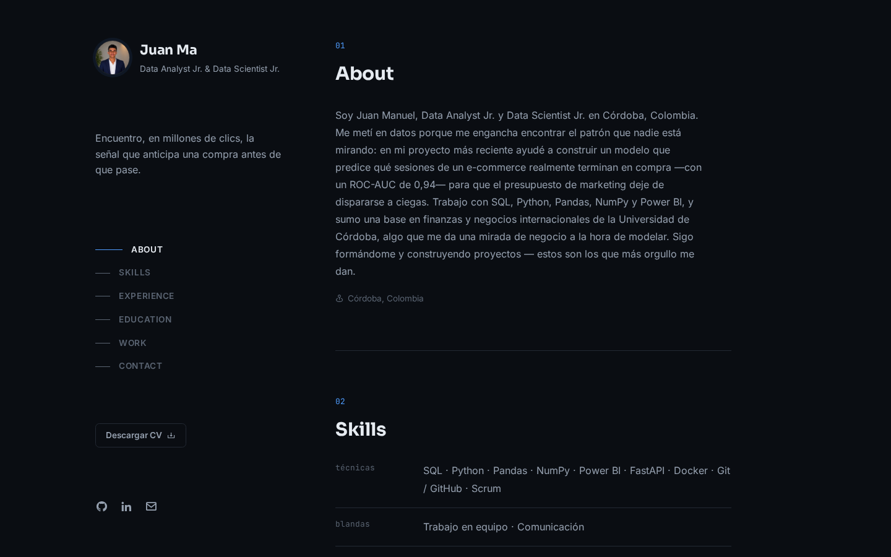
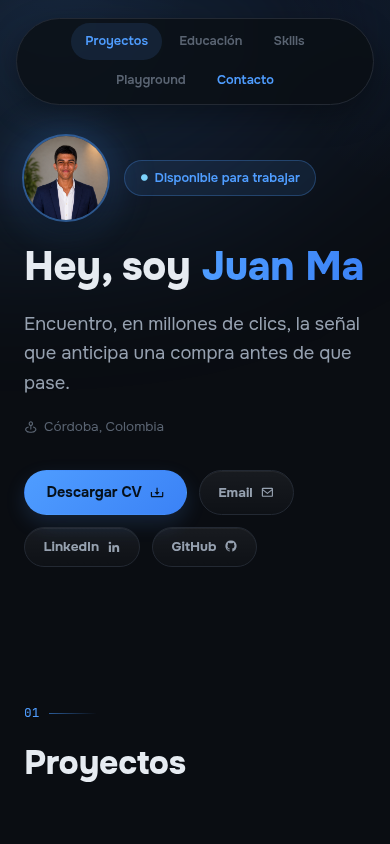
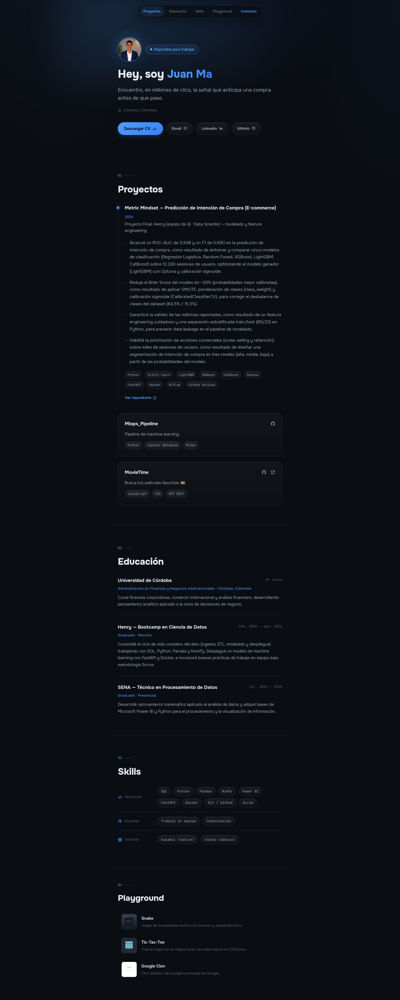

<div align="center">

# 📊 Portafolio — Juan Manuel Alvarado Pallares

**Encuentro, en millones de clics, la señal que anticipa una compra antes de que pase.**
Portafolio personal construido con React: proyectos reales de datos, con métricas reales, sin relleno.

[](https://juanma-alvarado.github.io/PortafolioWeb/)


</div>

<br>

<div align="center">
  
</div>

<br>

## 📑 Contenido

- [Sobre el proyecto](#-sobre-el-proyecto)
- [Capturas](#-capturas)
- [Funcionalidades](#-funcionalidades)
- [Instalación](#-instalación)
- [Cómo está construido](#-cómo-está-construido)
- [Recursos útiles](#-recursos-útiles)
- [Licencia](#-licencia)
- [Autor](#-autor)

---

## 📖 Sobre el proyecto

Un CV en PDF no hace scroll, no tiene glow y no puede mostrar un modelo con ROC-AUC de 0,938 corriendo en un demo.

Este portafolio resuelve eso. Como Data Analyst Jr. y Data Scientist Jr., mi mejor argumento no es la experiencia sino la evidencia: proyectos terminados, métricas reales, código que corre. Quería un espacio donde quien entrara pudiera responder rápido tres preguntas — *¿qué sabe hacer?*, *¿con qué herramientas?* y *¿tiene algo real detrás?* — sin scrollear infinito ni leer un muro de texto. De ahí las decisiones de diseño: un proyecto destacado con métricas en vez de una lista genérica de repos, chips en vez de párrafos de tecnologías, y una sola pantalla de entrada que resume quién soy en cinco segundos.

## 🖼️ Capturas

| Desktop | Mobile |
|---|---|
|  |  |

<details>
<summary>Ver la página completa</summary>



</details>

## ✨ Funcionalidades

| | |
|---|---|
| 🏆 | Proyecto destacado con métricas reales — ROC-AUC 0,938, F1 0,690 — en vez de una lista genérica de repos |
| 🧩 | Contenido 100% real: cada dato sale del CV, nada de *lorem ipsum* |
| 🎨 | Sistema visual propio: glow azul ambiental, glassmorphism sutil, tipografía Onest |
| 🧭 | Navegación flotante centrada que resalta la sección activa mientras se scrollea |
| 📬 | Accesos directos reales: CV, mail, LinkedIn y GitHub a un clic — sin formularios de contacto |
| 📱 | Responsive de punta a punta, con animaciones de entrada sutiles |
| 🕹️ | Playground con mini-proyectos de práctica (Snake, Tic-Tac-Toe, clon de Google) |

## 🔧 Instalación

Requiere Node.js 18+.

```bash
git clone https://github.com/Juanma-Alvarado/PortafolioWeb.git
cd PortafolioWeb
npm install
npm run dev
```

Abre `http://localhost:5173/PortafolioWeb/`.

### Build y despliegue

El sitio se publica con **GitHub Pages** sirviendo la carpeta `docs/` de la rama `master`. No hay CI: el build se genera y se commitea a mano.

```bash
npm run build   # genera/sobreescribe docs/
git add docs
git commit -m "build: actualizar sitio publicado"
git push
```

## 🏗️ Cómo está construido

Este sitio no nació así. Empezó como un layout de sidebar fijo con foto circular, pasó por un rediseño visual inspirado en la estética editorial de [librosgratis.dev](https://librosgratis.dev/) (glows, tipografía serif, glassmorphism), y terminó reestructurado a un layout vertical de una sola columna con nav flotante, tomando como referencia directa la organización de [porfolio.dev](https://porfolio.dev/). Cada iteración se probó en pantalla real antes de darla por buena.

- **React + Vite** — SPA de una sola página, sin meta-framework: no necesita SSR ni routing.
- **CSS plano con custom properties** — sin Tailwind ni librerías de componentes; todo el sistema de color, tipografía y espaciado vive en variables reutilizables en `src/styles/index.css`.
- **[Boxicons](https://boxicons.com/)** — la iconografía de toda la interfaz.
- **[Onest](https://fonts.google.com/specimen/Onest)** — tipografía variable.
- **Sin backend ni formularios** — el contacto son enlaces reales (`mailto:`, GitHub, LinkedIn) y una descarga directa del CV. Menos piezas que puedan romperse.

<details>
<summary>Ver estructura de carpetas</summary>

```
├── index.html          # entry point de Vite
├── src/
│   ├── components/      # Header (nav flotante), Hero, Projects, Education, Skills, ExtraProjects, Footer, Loader
│   ├── data/content.js  # todo el contenido (perfil, experiencia, educación, skills, proyectos)
│   ├── styles/index.css # tema visual (variables de color, tipografía, layout)
│   └── hooks/useReveal.js
├── public/              # assets estáticos (imagen de perfil, CV, mini-proyectos viejos)
└── docs/                 # ⚠️ carpeta GENERADA por `npm run build` — no editar a mano, la sirve GitHub Pages
```

</details>

## 📚 Recursos útiles

- [React](https://react.dev/) y [Vite](https://vitejs.dev/) — documentación oficial.
- [Boxicons](https://boxicons.com/) — iconografía.
- [Onest en Google Fonts](https://fonts.google.com/specimen/Onest) — la tipografía del sitio.
- [porfolio.dev](https://porfolio.dev/) y [librosgratis.dev](https://librosgratis.dev/) — referencias de diseño que inspiraron la estructura y el sistema visual.
- [Shields.io](https://shields.io/) — badges de este README.
- Iteraciones de diseño y refactor hechas en pareja con [Claude Code](https://claude.com/claude-code).

## 📄 Licencia

El código de este repositorio se distribuye bajo licencia **MIT** — usalo, adaptalo, aprendé de él. El contenido personal (foto, CV, biografía, proyectos descritos) no está cubierto por la licencia y sigue siendo propiedad de su autor.

## 👤 Autor

**Juan Manuel Alvarado Pallares** — Data Analyst Jr. & Data Scientist Jr.
[GitHub](https://github.com/Juanma-Alvarado) · [LinkedIn](https://www.linkedin.com/in/juanma-alvarado/)
